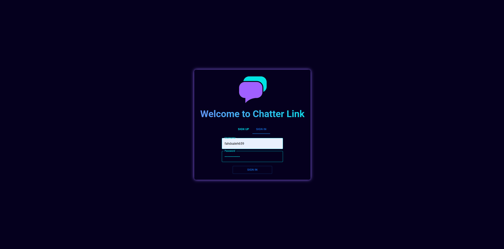
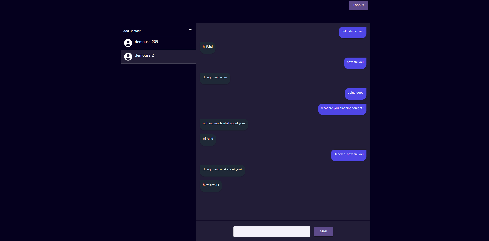
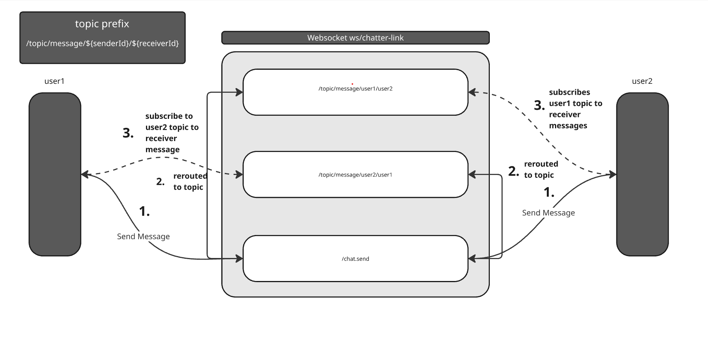
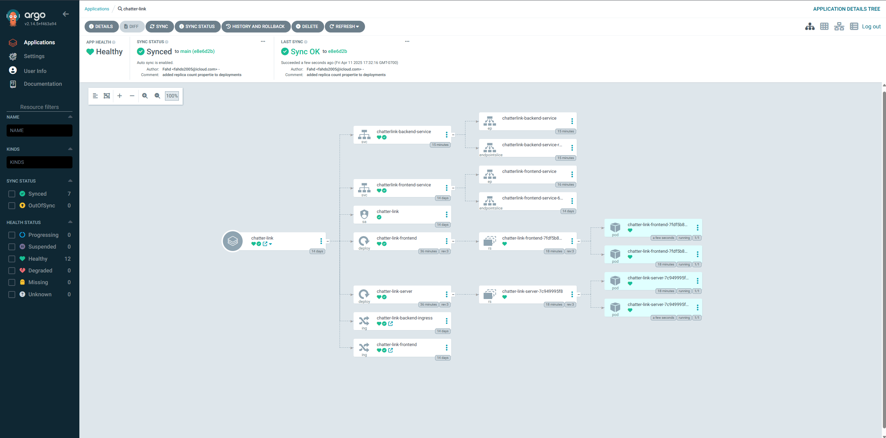
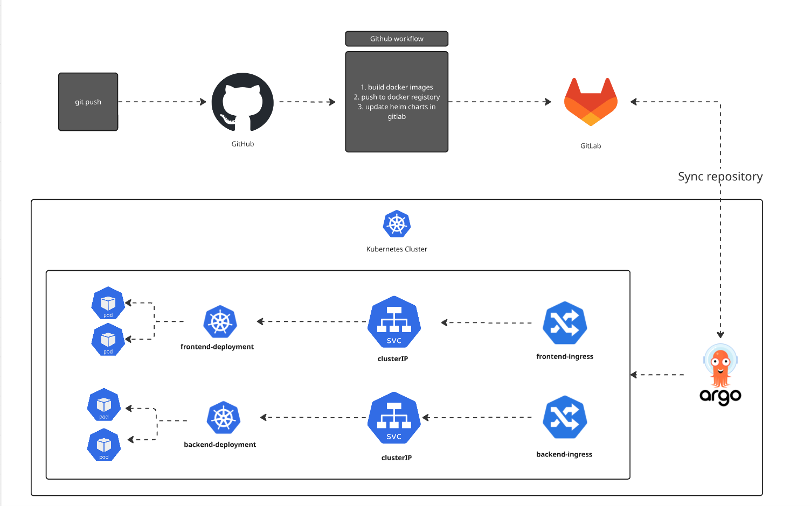

# Chatter Link
Welcome to chatter link - A daynmic and scalable chat application

## Overview
This application demonstrates my practical expertise in full-stack development and DevOps practices, designed with scalability in mind. Instead of running locally, the application is deployed in a Kubernetes cluster, providing built-in scalability and reliability.

For real-time communication, I implemented WebSockets, which streamline messaging and reduce unnecessary API calls to the back end, significantly optimizing performance.

To enable seamless delivery, I set up a CI/CD pipeline leveraging ArgoCD, ensuring that every code push to the repository is automatically synchronized with the Kubernetes cluster for continuous deployment.

## Tech stack
1. Spring Boot – Backend framework for building scalable and secure REST APIs

2. React.js – Frontend framework for creating dynamic and responsive user interfaces

3. WebSockets – Real-time messaging to optimize communication and reduce API overhead

4. MongoDB – Flexible NoSQL database for handling diverse and evolving data structures

5. GitHub Actions – Automated CI pipeline to build Docker images and update Helm charts on every push

6. GitLab – Repository for managing and storing Helm charts

7. ArgoCD – Continuous delivery tool that monitors Helm charts and automatically syncs deployments in Kubernetes

## Chat application

### login page

### Chat page

## Websocket for dynamic messaging

### Kubernetes infrastructure syncing with argocd

## CI/CD pipeline with argocd

